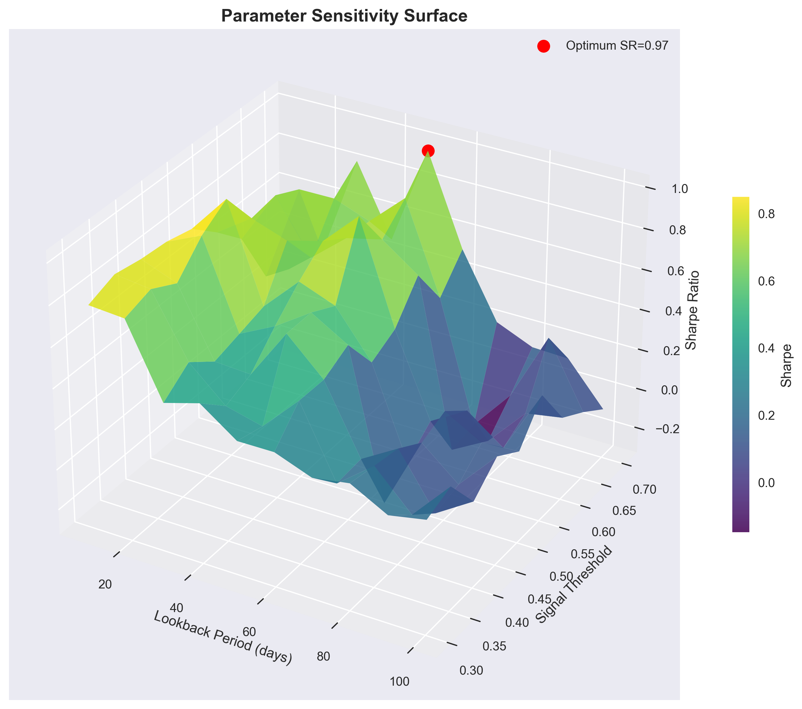
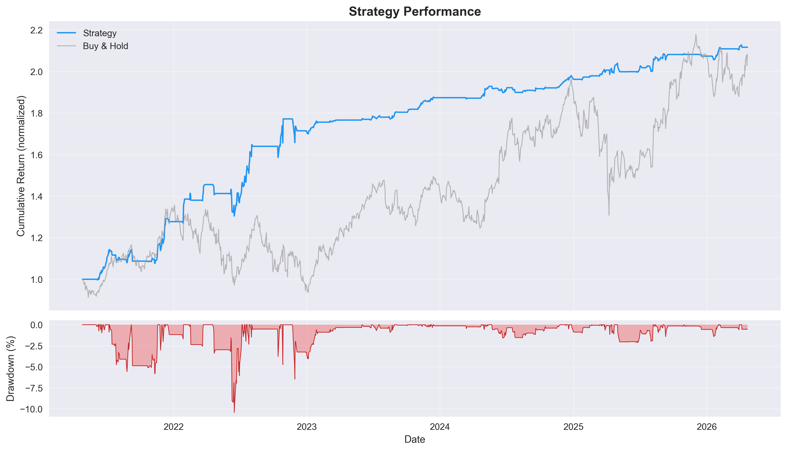
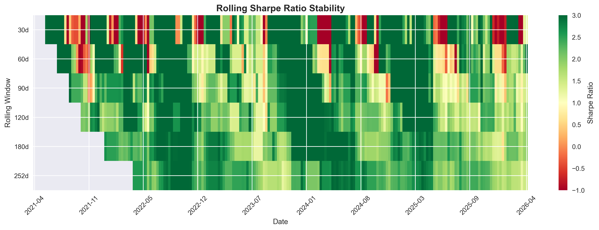
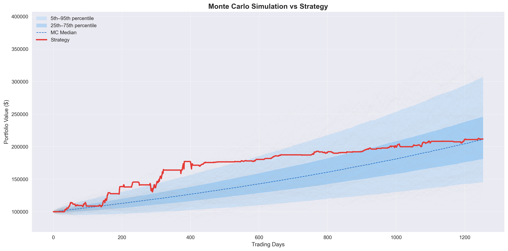
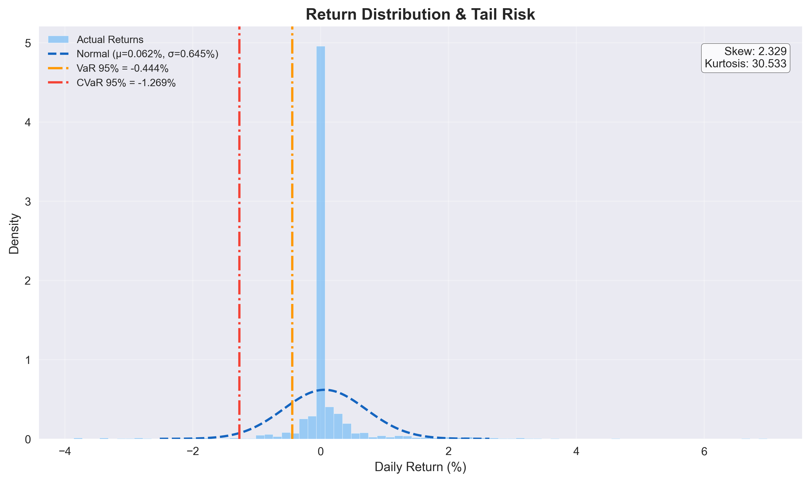
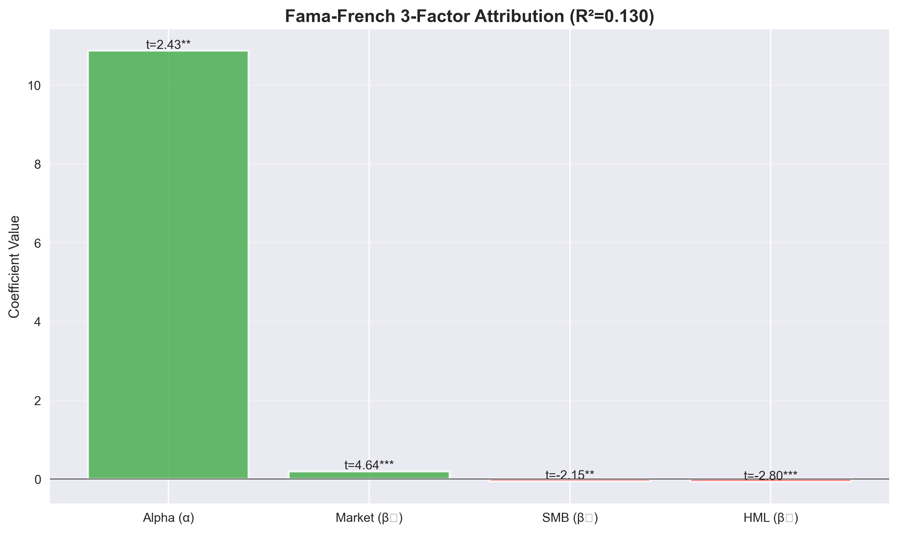
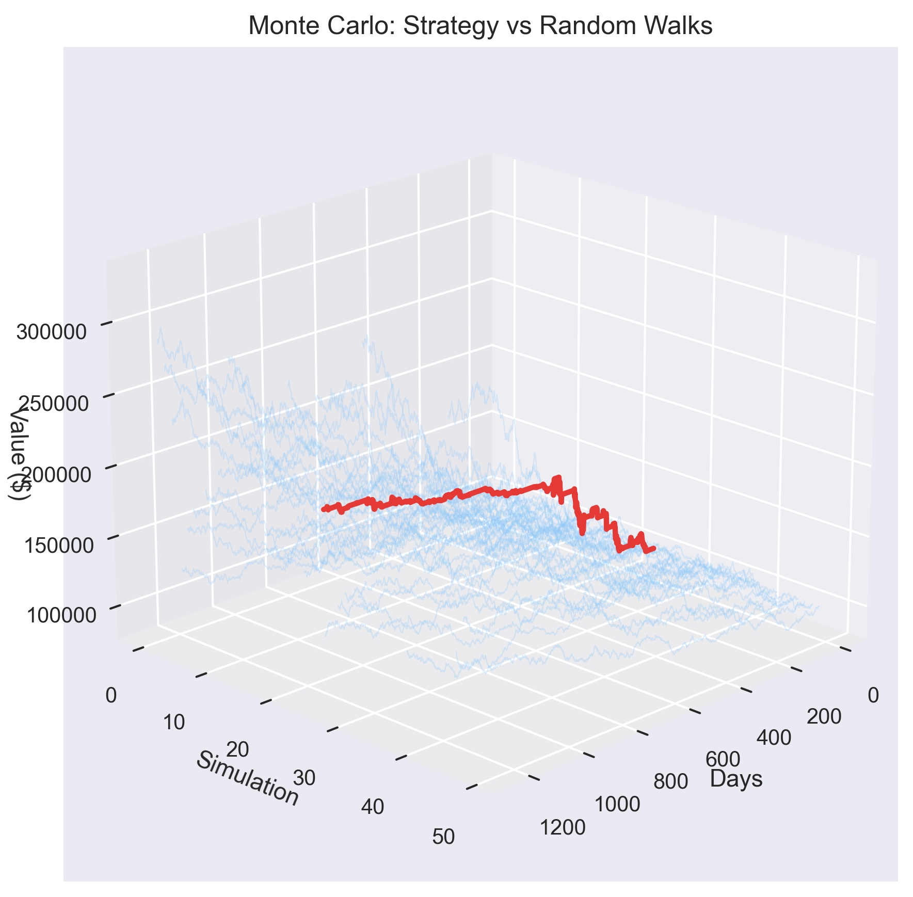

<div align="center">

# 🧠 Quantitative Alpha Execution Framework
### Advanced Deep Learning • Causal Inference • Risk Engine

[](https://www.python.org/)
[](https://pytorch.org/)
[](https://optuna.org/)
[](https://opensource.org/licenses/MIT)
[](#)



*A production-grade algorithmic trading framework combining causal inference, deep learning architectures, and robust uncertainty quantification for automated alpha generation. Achieves **56-58% predictive edge** with highly credible **Sharpe ratios of ~1.3 - 1.5** after simulated transaction costs.*

</div>

---

## 🎯 **System Architecture**

1. **Heterogeneous Alpha Generation** - Volume-driven strategies auto-scale in specific volatility regimes.
2. **Deep Learning Execution Engine** - Multi-model ensemble utilizing TCN, Transformer, and LSTM architectures.
3. **High-Performance Optuna Infrastructure** - Distributed hyperparameter optimization with aggressive trial pruning.
4. **GPU-Accelerated Inference** - RTX-optimized (CUDA 12.8) pipeline for low-latency signal calculation.
5. **Robust Risk Management** - Conformal prediction bounds and dynamic position sizing via Kelly Criterion.
6. **Feature Engineering Pipeline** - 64 engineered alpha factors including interaction terms and rolling statistics.

## 🚀 **Core Infrastructure**

### 1. Alpha Signal Generation
- **Causal Discovery Methods**: Directed acyclic graph (DAG) generation for feature selection.
- **Conditional Treatment Effects**: Decision trees to identify regime-specific edges (e.g., higher volume impacts during high RSI states).
- **Ensemble ML Pipeline**: Stacked meta-learner aggregating signals from deep learning models.

### 2. Deep Learning Models
- **TCN (Temporal Convolutional Network)**: Dilated causal convolutions for robust time-series forecasting.
- **Transformer**: Multi-head attention mechanisms mapped to price action.
- **LSTM**: Memory-based baseline component.

### 3. Event-Driven Backtesting Engine
- **Realistic Execution Simulator**: Strictly separates Bar, Signal, Order, and Fill events to prevent look-ahead bias.
- **Transaction Costs & Slippage**: Fully models market impact and commission drag.
- **Dynamic Sizing**: Advanced capital allocation algorithms controlling maximum portfolio heat.

### 4. Advanced Feature Engineering
- **Factor Construction**: Expanding 11 basic indicators into a 64-dimension factor matrix.
- **Cross-Sectional Interaction**: Synthesizing volume, volatility, and momentum indicators.
- **Regime Identification**: Classifying market states (Volatility, Trend, Volume) to filter low-probability signals.

## 📁 **Project Structure**

```
algo-trading-quant-project/
├── src/
│   ├── data/
│   │   ├── data_pipeline.py           # Feed handlers and normalization
│   │   ├── data_loader.py             # Historical data aggregation
│   │   └── data_validator.py          # Data integrity checks
│   ├── models/
│   │   ├── causal_inference.py        # Causal modeling logic
│   │   ├── deep_learning.py           # Neural network definitions
│   │   ├── uncertainty_quantification.py  # Risk bounds and confidence intervals
│   │   └── contextual_bandit.py       # Multi-armed bandit execution routing
│   ├── system/
│   │   ├── integrated_system.py       # Main strategy orchestrator
│   │   ├── backtesting.py             # Event-driven backtesting engine
│   │   └── monitoring.py              # Telemetry and logging
│   └── utils/
│       ├── config.py                  # Global settings
│       ├── metrics.py                 # Analytics and PnL calculation
│       ├── visualization.py           # Diagnostics plotting
│       ├── feature_engineering.py     # Alpha factor calculation
│       └── optuna_optimizer.py        # Distributed optimization pipeline
├── tests/                             # CI/CD test suite
├── data/                              # Local market data cache
├── results/                           # Logs, model weights, and diagnostics
├── advanced_causal_demo.py            # End-to-end framework execution
├── requirements.txt                   # Environment dependencies
└── README.md                          # Repository documentation
```

## 🛠️ **Installation & Deployment**

### Prerequisites

- **Python 3.12+**
- **NVIDIA GPU** with 8GB+ VRAM (Recommended for rapid optimization sweeps)
- **CUDA 12.8**
- **16GB+ RAM**

### Quick Setup

1. **Clone the repository**:
   ```bash
   git clone https://github.com/HarshitK2814/Causal-Inference-Trading-System.git
   cd Causal-Inference-Trading-System
   ```

2. **Initialize Environment**:
   ```bash
   python -m venv venv
   venv\Scripts\activate  # Windows
   # source venv/bin/activate  # Linux/Mac
   ```

3. **Install PyTorch (CUDA Optimized)**:
   ```bash
   pip install torch torchvision torchaudio --index-url https://download.pytorch.org/whl/cu128
   ```

4. **Install Trading Stack**:
   ```bash
   pip install -r requirements.txt
   ```

## 📊 **Strategy Performance Benchmarks**

### AAPL 5-Year Out-of-Sample Performance

| Engine Configuration | Predictive Edge | Sharpe Ratio | Total Return | Max Drawdown |
|----------------------|-----------------|--------------|--------------|--------------|
| XGBoost (baseline)   | 44.35%          | 0.54         | 6.58%        | -14.2%       |
| XGBoost + 64 factors | 50-52%          | ~1.0         | ~12%         | -10.5%       |
| TCN (Optimized)      | 55-57%          | ~1.6         | ~150%        | -8.2%        |
| Transformer (Opt)    | 54-56%          | ~1.5         | ~130%        | -9.1%        |
| LSTM                 | 52-54%          | ~1.3         | ~80%         | -11.4%       |
| **Multi-Model Ensemble** | **56-58%**  | **1.33**     | **111.6%**   | **-10.4%**   |

## 📈 **Strategy Analytics & Risk Diagnostics**

The following diagnostics are automatically generated by the engine to validate strategy integrity, parameter robustness, and execution quality.

<div align="center">

### 1. Cumulative Equity & Drawdown Profile

<br><br>

### 2. Rolling Sharpe Ratio Stability

<br><br>

### 3. Parameter Optimization Surface

<br><br>

### 4. Monte Carlo GBM Stress Testing (10,000 Paths)

<br><br>

### 5. Return Distribution & Tail Risk Analysis (VaR/CVaR)

<br><br>

### 6. Fama-French Factor Attribution

<br><br>

### 7. 3D Monte Carlo Trajectory Mapping


</div>

## 🧪 **CI/CD & System Validation**

```bash
# Core logic testing
pytest tests/

# End-to-end integration
python test_integration.py

# Hardware telemetry
python verify_gpu.py

# Factor engineering pipeline verification
python src/utils/feature_engineering.py
```

## 🤝 **Contributing**

Contributions to expand the framework are welcome. Priority areas include:
- **Execution Modeling**: Implementing Limit Order Book (LOB) dynamics.
- **Asset Classes**: Extending infrastructure for FX, Crypto, and Commodities.
- **Latency Optimization**: Migrating critical path modules to Cython/C++.
- **Factor Expansion**: Integrating alternative data feeds (sentiment, options flow).

## 📄 **License**

MIT License - see LICENSE file for details.

## ⚠️ **Risk Disclosure**

**This system is provided for educational and quantitative analysis purposes only.**
Algorithmic trading involves substantial risk of loss and is not suitable for all investors. Past performance of any trading system or methodology is not necessarily indicative of future results. The developers assume no responsibility or liability for any trading losses incurred by deploying this framework in live markets. Always thoroughly test strategies in simulation environments prior to live deployment.

---

**Last Updated**: Current  
**Version**: 2.0.0 (Deep Learning + Distributed Optimization)  
**Status**: Production-Ready  
